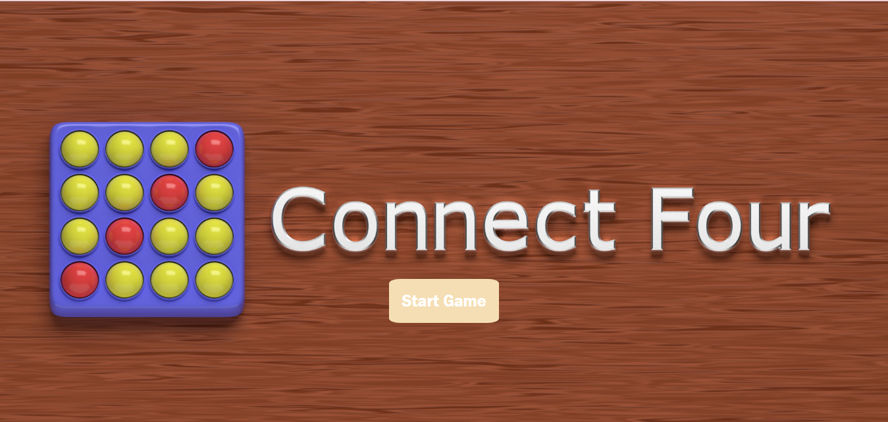
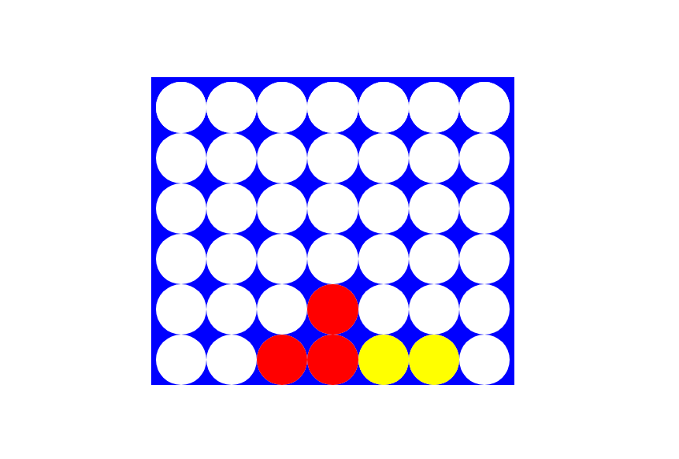
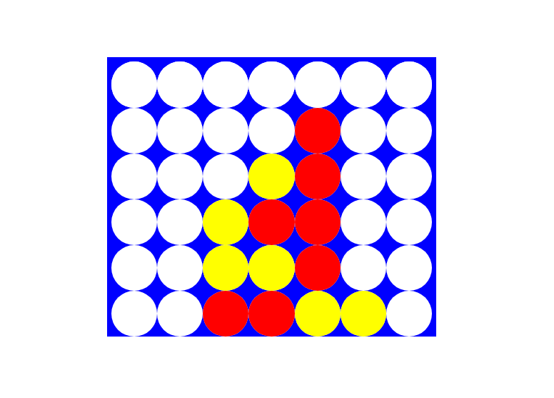

# CONNECT FOUR

## Date : 5/19/2024

#### By: Maryam Almutawa
---
 [GitHub](https://github.com/MaryamAlmutawa9) | [Linkedln](https://www.linkedin.com/) 
***
### ***Description***

Connect 4 game consists of 7 columns and 6 rows. It is played by two red and yellow players, and whoever connects four vertically, horizontally or diagonally wins the game and it stops.

### ***Technologies***

* HTML
* Css
* JavaScript

### Screenshots
**image index**

**image game**

### Future Updates
- [ ] Future Update 1
- [ ] Future Update 2
- [x] Completed Update
- [x] ~~Strikethrough~~ Items Also

